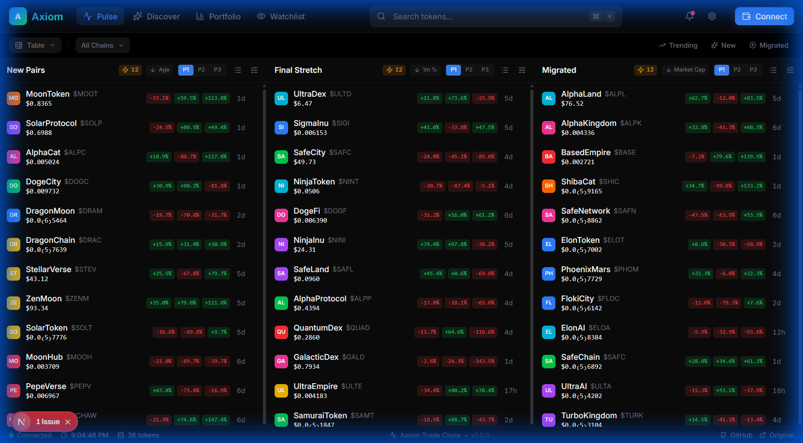
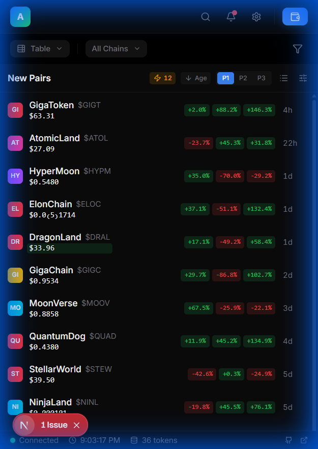
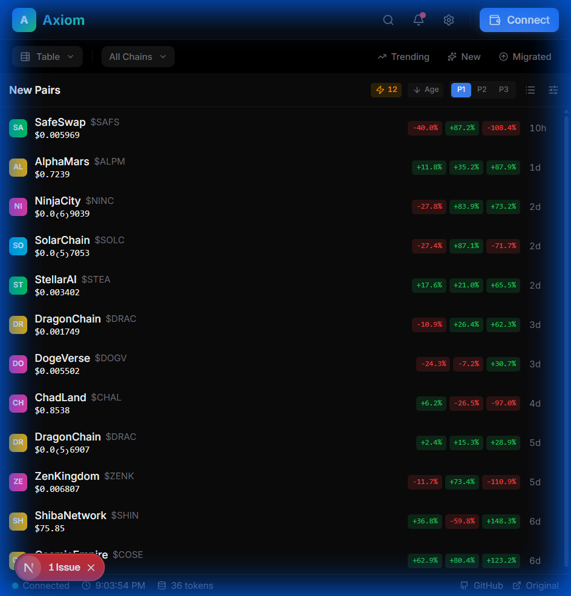
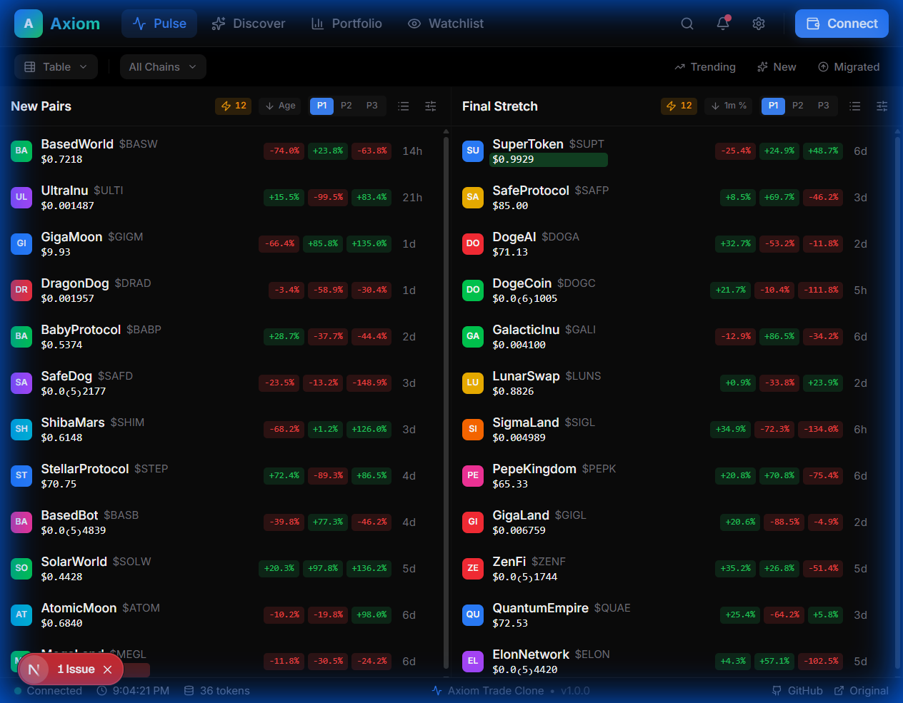

# Axiom Trade - Token Discovery Table

A pixel-perfect clone of Axiom Trade's Pulse page - a real-time token discovery dashboard with live price updates, sorting capabilities, and responsive design.



## 🚀 Live Demo

- **Vercel Deployment**:https://eterna-labs-test.vercel.app/
- **Video Demo**: [Add your YouTube link here]

## ✨ Features

- **Real-time Price Updates** - WebSocket-powered live price animations with green/red flash effects
- **Three-Column Layout** - New Pairs, Final Stretch, and Migrated token categories
- **Advanced Sorting** - 9 sort options per column (Age, Price, Volume, etc.) with asc/desc toggle
- **Token Detail Modal** - Click any row to view comprehensive token information
- **Virtual Scrolling** - Optimized performance for large token lists using `@tanstack/react-virtual`
- **Responsive Design** - Fully responsive from 320px mobile to 1920px desktop
- **Dark Theme** - Professional dark-themed UI matching production Axiom Trade

## 🛠️ Tech Stack

| Category | Technologies |
|----------|-------------|
| **Framework** | Next.js 16, React 19, TypeScript |
| **Styling** | Tailwind CSS 4, CSS Variables |
| **State Management** | Redux Toolkit, React Query |
| **UI Components** | Radix UI, Framer Motion |
| **Testing** | Playwright (Visual, A11y, Performance) |
| **Performance** | Virtual Scrolling, Bundle Analysis |

## 📱 Responsive Layout Snapshots

The application is fully responsive with auto-layout from 320px to 1920px width.

### Mobile (320px)


### Tablet (768px)


### Desktop (1024px)


### Large Desktop (1440px)


## 🏗️ Project Structure

```
src/
├── app/                    # Next.js App Router
│   ├── layout.tsx          # Root layout with providers
│   ├── page.tsx            # Main token discovery page
│   └── globals.css         # Global styles & CSS variables
├── components/
│   ├── atoms/              # Basic UI elements (Button, Icon, etc.)
│   ├── molecules/          # Composite components (TokenRow, PriceCell)
│   └── organisms/          # Complex components (Header, TokenColumn)
├── hooks/                  # Custom React hooks
│   ├── useTokenData.ts     # React Query data fetching
│   ├── useSortedTokens.ts  # Sorting logic
│   └── useWebSocket.ts     # Real-time updates
├── store/                  # Redux Toolkit store
│   ├── slices/             # Feature slices
│   └── selectors.ts        # Memoized selectors
└── types/                  # TypeScript definitions
```

## 🚀 Getting Started

### Prerequisites
- Node.js 18+ 
- npm or yarn

### Installation

```bash
# Clone the repository
git clone https://github.com/your-username/etrnal-labs-test.git
cd etrnal-labs-test

# Install dependencies
npm install

# Run development server
npm run dev
```

Open [http://localhost:3000](http://localhost:3000) to view the application.

### Available Scripts

| Command | Description |
|---------|-------------|
| `npm run dev` | Start development server |
| `npm run build` | Create production build |
| `npm run start` | Start production server |
| `npm run lint` | Run ESLint |
| `npm run test` | Run all Playwright tests |
| `npm run test:visual` | Run visual regression tests |
| `npm run test:a11y` | Run accessibility tests |
| `npm run test:perf` | Run performance tests |
| `npm run analyze` | Analyze bundle size |

## 🧪 Testing

The project includes comprehensive testing with Playwright:

- **Visual Regression** - Pixel-perfect comparison (≤2px tolerance)
- **Accessibility Audit** - WCAG compliance with axe-core
- **Performance Testing** - Interaction latency < 100ms

```bash
# Run all tests
npm run test

# Update visual snapshots
npm run test:update
```


### Manual Build

```bash
npm run build
npm run start
```

## 📋 Features Checklist

- [x] Next.js 14+ with App Router
- [x] TypeScript strict mode
- [x] Tailwind CSS with custom theme
- [x] Redux Toolkit state management
- [x] React Query for data fetching
- [x] Real-time WebSocket updates
- [x] Virtual scrolling for performance
- [x] Responsive design (320px - 1920px)
- [x] Dark theme UI
- [x] Token sorting (9 options)
- [x] Token detail modal
- [x] Loading skeletons
- [x] Error boundaries
- [x] Accessibility (WCAG)
- [x] Visual regression tests
- [x] Performance optimizations

## 📄 License

This project was created as a technical assessment for Eterna Labs.

---

Built with ❤️ using Next.js, TypeScript, and Tailwind CSS
